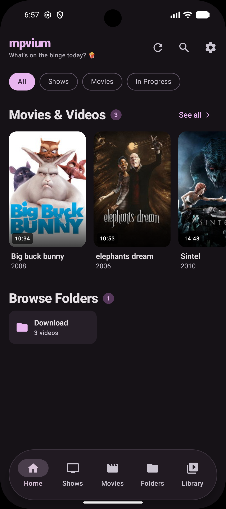
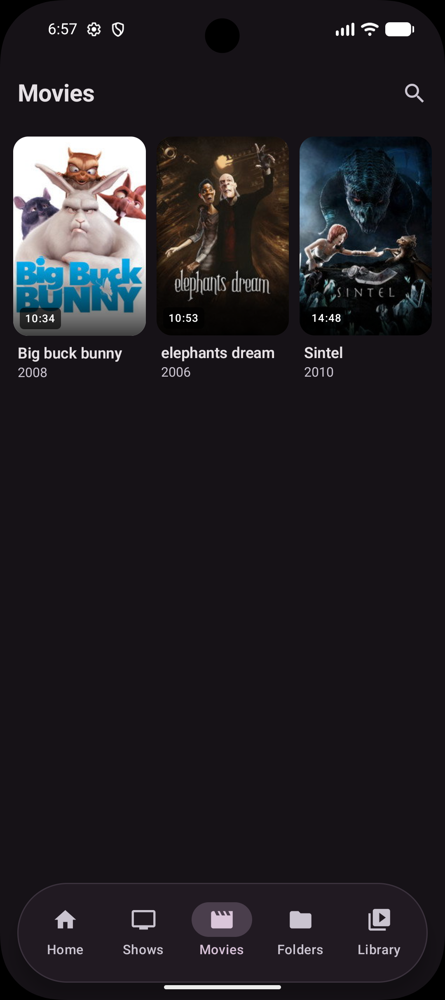
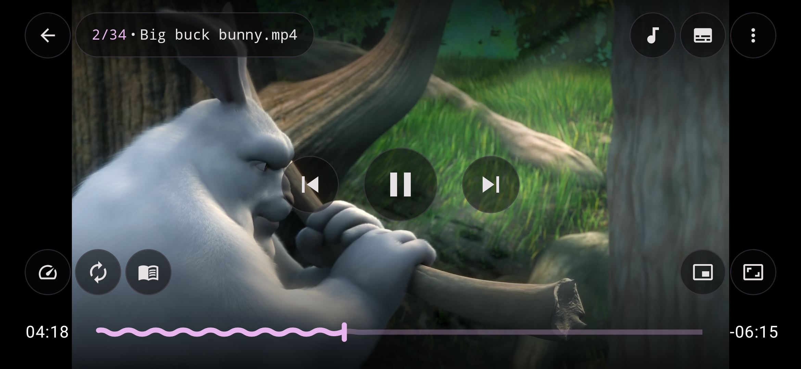
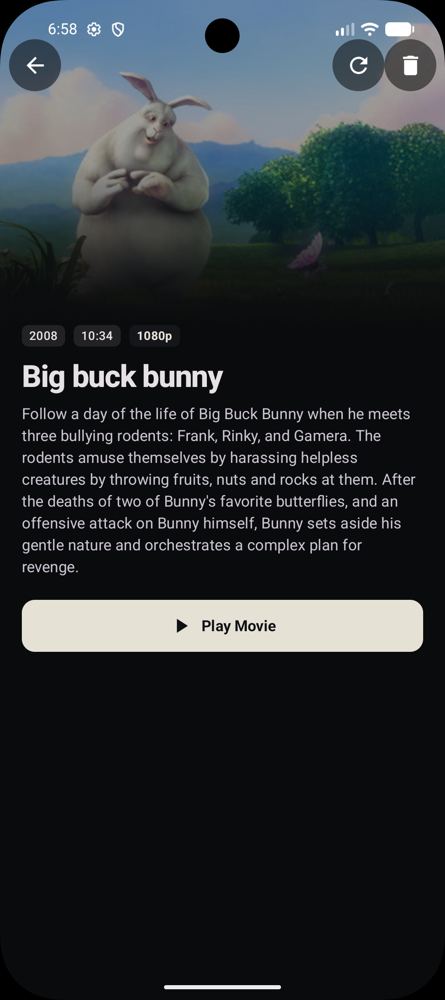

<div align="center">


<!--  -->

# mpvium

**Sane defaults, pro-level control.**

An Android video player powered by [mpv](https://mpv.io/) and
[libmpv](https://github.com/mpv-player/mpv).

[](https://github.com/aryan447/mpvium/releases/latest)
[](https://github.com/aryan447/mpvium/releases)
[](https://t.me/mpvium)
[](LICENSE)

</div>

## About

mpvium is a free and open-source Android frontend for mpv. It combines
mpv’s flexible playback engine with a modern Material 3 interface, convenient
media browsing, and support for local and network media.

Philosophy: sane defaults, pro-level control — opinionated for everyday
watching, fully customizable for pros.

The project is actively developed. Preview builds may contain unfinished
features or bugs.

## Screenshots

<p align="center">
  
  
  
  
</p>

<p align="center">
  <a href="docs/screenshots/">More screenshots</a> · Play Store set in <code>fastlane/metadata/android/en-US/images/phoneScreenshots/</code>
</p>

## Features

- Hardware-accelerated, high-quality video playback through libmpv
- Material 3 interface with light and dark themes
- Picture-in-picture and background playback
- Gesture controls, zoom, and screen orientation controls
- Chapters, playlists, playback history, and resume support
- External subtitles and audio tracks
- Local media browsing with folder and tree views
- Network playback through SMB, FTP, and WebDAV
- Custom mpv configuration, scripts, and advanced playback options
- Media information and metadata caching
- No advertisements and no unnecessary permissions

## Download

Download the latest APK from the
[GitHub Releases](https://github.com/aryan447/mpvium/releases) page.

The repository may provide several APKs for different CPU architectures:

| APK | Devices |
| --- | --- |
| `universal` | Most devices; larger download |
| `arm64-v8a` | Modern 64-bit ARM devices; recommended for most phones |
| `armeabi-v7a` | Older 32-bit ARM devices |
| `x86` | 32-bit Intel/AMD devices |
| `x86_64` | 64-bit Intel/AMD devices |

Preview builds are intended for testing and may be available through the
project’s [preview releases](https://github.com/aryan447/mpvium/releases).

## Build from source

### Requirements

- JDK 17
- Android SDK with compile SDK 36
- Git

The project uses Kotlin, Jetpack Compose, Material 3, Room, Koin, and native
components for media playback. Dependencies are resolved by Gradle and some
are hosted on JitPack.

Builds are normally performed by GitHub Actions. If you build locally, the
Gradle wrapper may download the required Gradle distribution and dependencies.

```bash
bash ./gradlew assembleStandardDebug
```

Useful build variants include:

```bash
bash ./gradlew assembleStandardRelease
bash ./gradlew assemblePlaystoreRelease
bash ./gradlew assembleStandardPreview
```

The generated APKs are written to `app/build/outputs/apk/`.

## Flavors

- `standard` — full-featured build with update support
- `playstore` — Google Play-compatible build with restricted storage behavior

## Contributing

Bug reports, feature requests, and pull requests are welcome. Please read
[CONTRIBUTING.md](CONTRIBUTING.md), our [Code of Conduct](CODE_OF_CONDUCT.md),
and [SECURITY.md](SECURITY.md) first. Join our [Telegram community](https://t.me/mpvium)
for tester discussion, preview builds, and help.

- [Contributing guide](CONTRIBUTING.md)
- [Report a bug](https://github.com/aryan447/mpvium/issues/new?template=bug_report.md)
- [Request a feature](https://github.com/aryan447/mpvium/issues/new?template=feature_request.md)
- [Browse the source code](https://github.com/aryan447/mpvium)
- [Changelog](CHANGELOG.md)

Good first contributions: tablet / large-screen polish, performance +
battery measurements, player UX fixes, SMB / FTP / WebDAV fixes, docs.

## License

mpvium as a whole is distributed under the [GNU General Public License v3.0 or later](LICENSE).
It links GPL components (mpv, mpv-android, FFmpeg); see [NOTICE](NOTICE) for full attribution.
